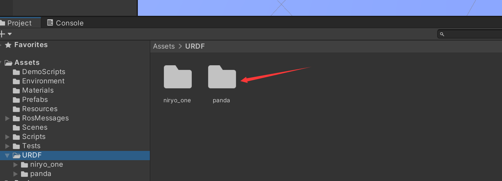
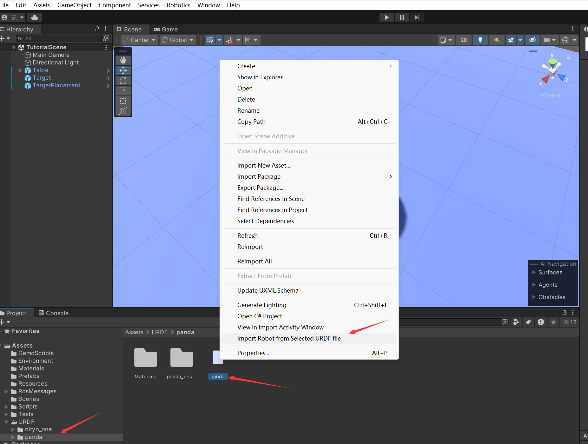
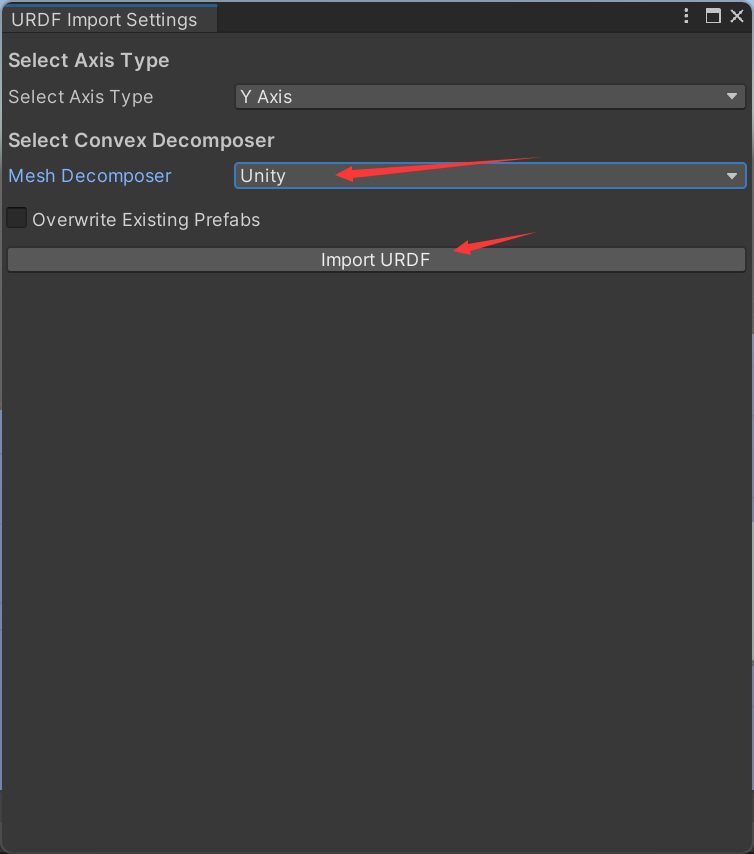
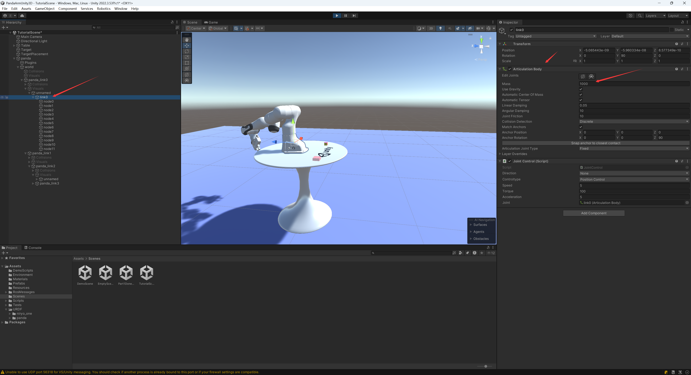

# unity导入urdf模型说明

1. 首先，文件夹的结构如下所示：

```
├── panda
   ├── panda_description
   │   └── meshes
   │       └── visual
   │       |    └── links
   │       └── collision
   │           └── stls
   └── panda.urdf
```

在urdf中，我们使用了以下路径来引用模型：

```xml
<mesh filename="package://panda_description/meshes/collision/link0.stl" />
```

2. 将文件夹复制到Unity项目中，如下所示：



3. 在Unity中，打开场景，导入urdf模型






# 固定底座

创建一个大质量的底座，并将其固定在原点。这样可以防止模型在运行时移动。

