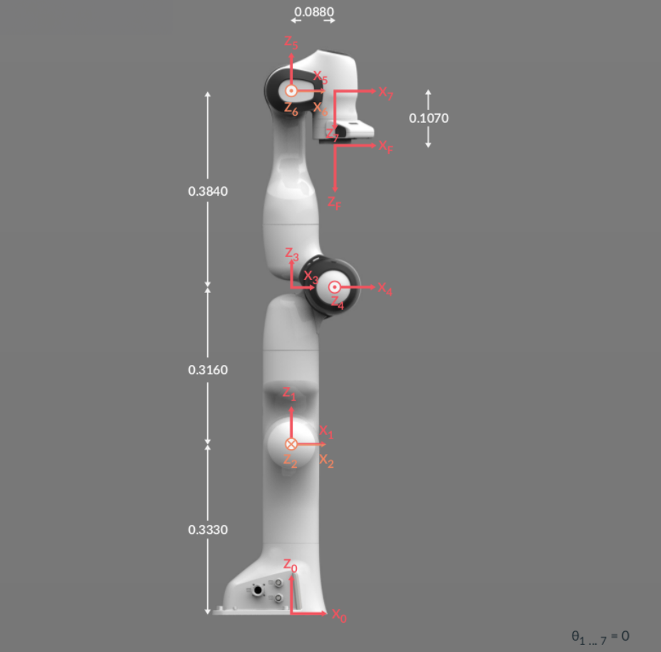
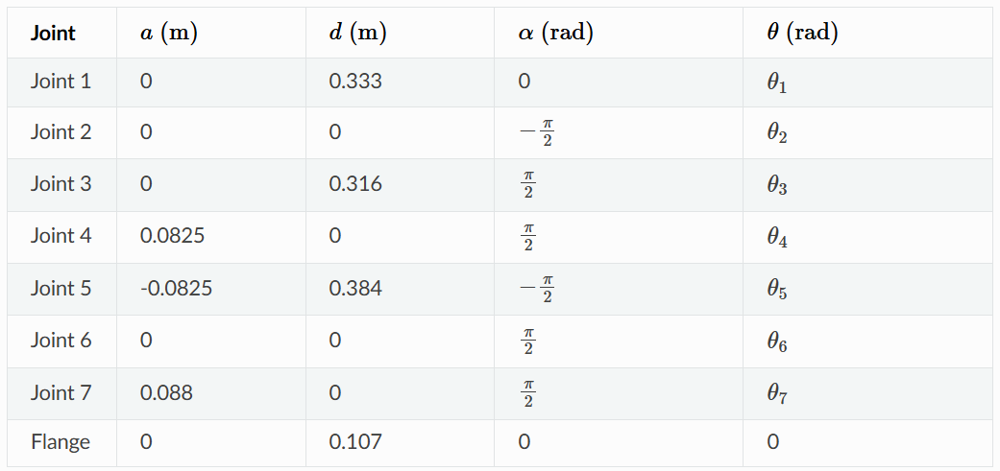
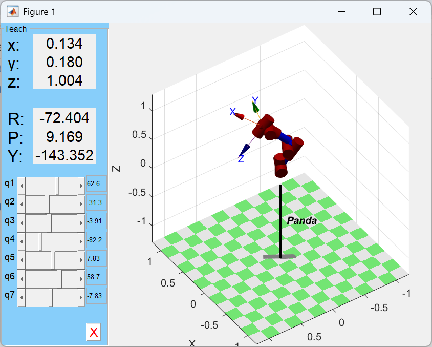
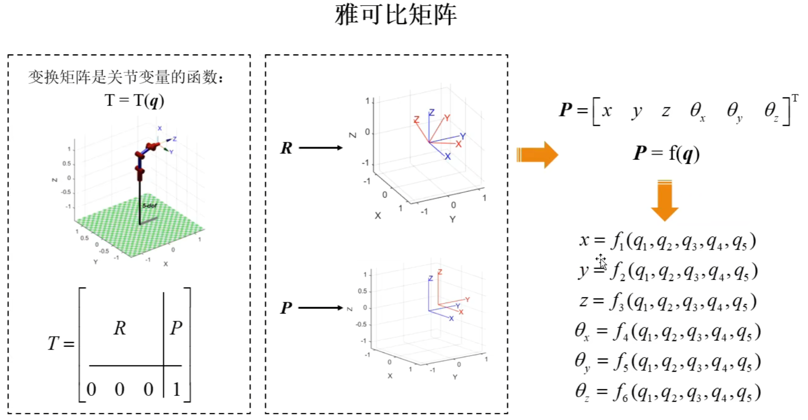
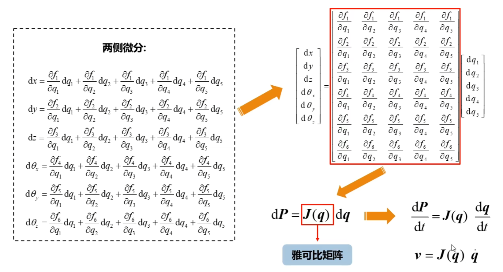
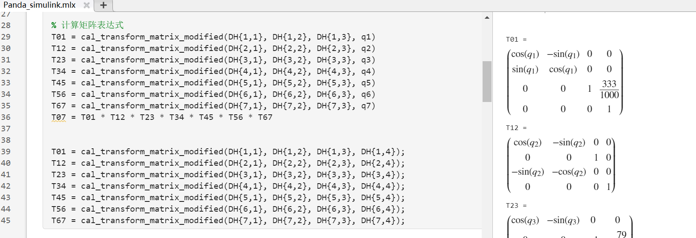
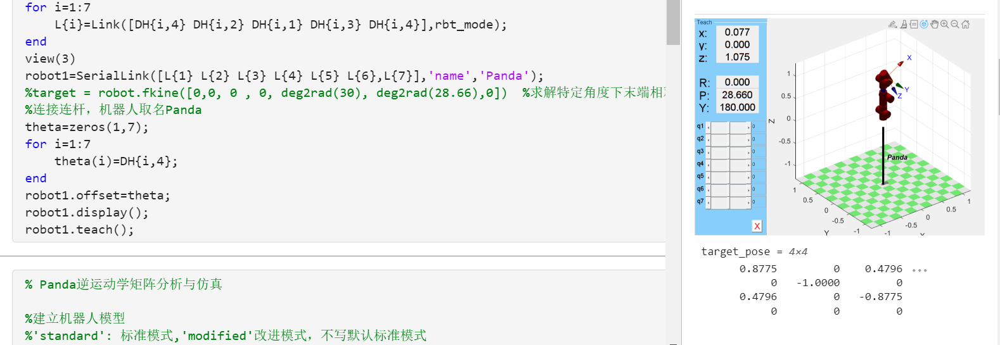
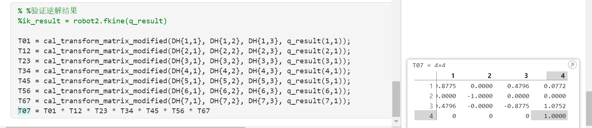

---

# 前言

机械臂的位置运动学分析是机器人控制与轨迹规划的核心基础，其研究内容主要分为正运动学（Forward Kinematics）和逆运动学（Inverse Kinematics）两大部分，二者构成运动学分析的完整闭环。

正运动学研究的是在已知机械臂各关节角度的条件下，通过数学模型计算末端执行器在三维空间中的位置（x, y, z坐标）和姿态（如欧拉角或四元数表示）。其本质是通过关节空间到笛卡尔空间的映射关系，建立末端位姿与关节变量的函数表达式。常用的建模方法包括几何分析法（适用于简单构型）、Denavit-Hartenberg（DH）参数法（标准DH法、改进DH方法）。改进DH法通过调整坐标系分配规则，更适用于具有平行关节或特殊拓扑结构的机械臂，本文即采用该方法构建运动学模型，其优势在于能减少奇异点并提高参数定义的规范性。

逆运动学则解决相反的问题：在给定末端执行器目标位姿的约束下，反推出机械臂各关节所需达到的角度值。这一过程具有更强的工程挑战性，主要体现在解的存在性（可达工作空间判断）、多解性（关节构型选择）以及求解算法的实时性等方面。常用的求解算法可分为两大类：

- 解析法（封闭解）：通过代数变换或几何分解直接推导关节角表达式。

- 数值法（迭代解）：采用雅可比矩阵迭代或优化算法逼近解，适用于通用构型但需处理收敛性问题。

正逆运动学的协同求解构成了机械臂轨迹生成与实时控制的理论基础，其中正运动学用于实际位姿反馈验证，逆运动学则服务于关节空间的目标规划，二者的精度与效率直接影响机械臂的整体性能。

# Panda机械臂的DH参数法建模

坐标系定义和DH参数确定

- $\alpha_{i}$：沿着$\hat{X}_{i-1}$方向看，从$\hat{Z}_{i-1}$转到$\hat{Z}_i$的旋转角度
- $a_{i-1}$：沿着$\hat{X}_{i-1}$方向，$\hat{Z}_{i-1}$和$\hat{Z}_i$间的距离（$a_{i}$>0）
- $\theta_{i}$：沿着$\hat{Z}_{i}$方向看，从$\hat{X}_{i-1}$转到$\hat{X}_i$的旋转角度
- $d_{i}$：沿着$\hat{Z}_{i}$方向，$\hat{X}_{i-1}$和$\hat{X}_i$间的距离（$d_i$>0）

几何参数

DH参数

# 正运动学

转换公式：

$$ \begin{aligned}
{ }_{i}^{i-1} T & =T_{\hat{X}_{i-1}}\left(\alpha_{i-1}\right) T_{\hat{X}_{R}}\left(a_{i-1}\right) T_{\hat{Z}_{Q}}\left(\theta_{i}\right) T_{\hat{Z}_{P}}\left(d_{i}\right) \\
& =\left[\begin{array}{cccc}
c \theta_{i} & -s \theta_{i} & 0 & a_{i-1} \\
s \theta_{i} c \alpha_{i-1} & c \theta_{i} c \alpha_{i-1} & -s \alpha_{i-1} & -s \alpha_{i-1} d_{i} \\
s \theta_{i} s \alpha_{i-1} & c \theta_{i} s \alpha_{i-1} & c \alpha_{i-1} & c \alpha_{i-1} d_{i} \\
0 & 0 & 0 & 1
\end{array}\right]
\end{aligned} $$

> 注意：$c\theta_{i}$表示$cos(\theta_{i})$，$s\theta_{i}$表示$sin(\theta_{i})$，其他同理。

则：

$$ \begin{aligned}
{ }_{1}^{0} T 
& =\left[\begin{array}{cccc}
c \theta_{1} & -s \theta_{1} & 0 & 0 \\
s \theta_{1}  & c \theta_{1}  & 0 & 0 \\
0  & 0 & 1 & 0.333 \\
0 & 0 & 0 & 1
\end{array}\right]
\end{aligned} $$

> 其中，$a_{0}=0$，$d_{1}=0.333$，$\alpha_{0}=0$

$$ \begin{aligned}
{ }_{2}^{1} T 
& =\left[\begin{array}{cccc}
c \theta_{2} & -s \theta_{2} & 0 & 0 \\
0 & 0 & 1 & 0 \\
-s \theta_{2}  & -c \theta_{2}  & 0 & 0 \\
0 & 0 & 0 & 1
\end{array}\right]
\end{aligned} $$

> 其中，$a_{1}=0$，$d_{2}=0$，$\alpha_{1}=-\pi/2$

$$ \vdots $$

$$ \begin{aligned}
{ }_{7}^{6} T 
& =\left[\begin{array}{cccc}
c \theta_{7} & -s \theta_{7} & 0 & 0.088 \\
0 & 0 & -1 & 0 \\
s \theta_{7}  & c \theta_{7}  & 0 & 0 \\
0 & 0 & 0 & 1
\end{array}\right]
\end{aligned} $$

> 其中，$a_{6}=0.088$，$d_{7}=0$，$\alpha_{6}=\pi/2$

最终末端执行器相对于基座坐标系的变换矩阵为：

$$ \begin{aligned}
{ }_{7}^{0} T 
& ={ }_{0}^{1} T { }_{1}^{2} T { }_{2}^{3} T { }_{3}^{4} T { }_{4}^{5} T { }_{5}^{6} T { }_{6}^{7} T
\end{aligned} $$

仿真分析

# 逆运动学

这里介绍一下通过数值法来逆向求解机械臂的关节角度。

## 误差函数

首先定义一个误差函数 $E$ ，它衡量末端执行器的实际位置和姿态与目标位置的差异：

$$ E = \left\| { }_{7}^{0} T - { }_{7}^{0} T^* \right\| $$

其中 ${ }_{7}^{0} T^*$ 是目标的位置和姿态的变换矩阵，$\| \|$ 表示的是范数（norm）。

## 雅可比矩阵

雅可比矩阵（Jacobian matrix）是求解逆运动学问题的关键工具。它是一个偏导数矩阵，表示末端执行器在基座坐标系下的位移分量对每个关节变量的变化率。

## 高斯-牛顿法（Gauss-Newton）

高斯-牛顿法是一种常用的数值优化方法，用于求解非线性最小二乘问题。在逆运动学中，我们可以将误差函数 $E$ 视为关于关节变量的非线性函数，并使用高斯-牛顿法来迭代地更新关节变量，以减小误差函数的值。

具体步骤如下：

1. **初始化**：选择一组初始的关节角度作为起点。
2. **计算雅可比矩阵和误差向量**：根据当前的关节角度，计算出末端执行器的位置和姿态（即变换矩阵），然后计算雅可比矩阵和误差向量。
3. **构建增广正规方程**：构造一个增广的正则化方程组，其中包括了雅可比矩阵的转置乘以雅可比矩阵加上一个正则项 $\lambda I$ （其中 $I$ 是单位矩阵，$\lambda > 0$）。这个正则项是为了防止奇异性的出现，特别是在某些关节接近极限时。
4. **解算增量**：通过解上述增广正规方程组，得到关节角度的增量。
5. **更新关节角度**：用得到的增量更新关节角度。
6. **重复以上步骤**：直到满足一定的收敛条件（例如，误差函数的值小于某个阈值，或者增量的大小足够小）。
7. 返回最终的关节角度。

其中的关键步骤为：

❇️创建一个6x6的单位矩阵W，用于在求解增广正规方程时乘以雅可比矩阵的转置和雅可比矩阵。

$$ \begin{aligned}
W = \begin{bmatrix}
1 & 0 & \cdots & 0 \\
0 & 1 & \cdots & 0 \\
\vdots & \vdots & \ddots & \vdots \\
0 & 0 & \cdots & 1
\end{bmatrix}_{6 \times 6}
\end{aligned} $$

❇️迭代求解

- 计算误差

通过正运动学求解当前的机械臂末端位姿矩阵：$\mathbf{T}_{\text{current}}=\operatorname{fkine}(\mathbf{q})$

$$ 
\mathbf{E}=\operatorname{tr2delta}\left(\mathbf{T}_{\text{current}}, \mathbf{T}_{\text {target }}\right) 
$$

 $$ \text{当误差小于容差时终止循环：} \left \| W*E \right \| < tol $$

- 计算雅可比矩阵

$$ \mathbf{J} = \text{jocobi} (\mathbf{q})$$

- 更新关节角

$$
\Delta\mathbf{q}=\left(\mathbf{J}^\top\mathbf{W}\mathbf{J}+(\lambda+\lambda_{\min})\mathbf{I}\right)^{-1}\mathbf{J}^\top\mathbf{W}\mathbf{E}
$$

$$
\mathbf{q}_{\mathrm{new}}=\mathbf{q}+\Delta\mathbf{q}^\top
$$

# 参考

> - [台大机器人学之运动学——林沛群（含课件+书籍）](https://www.bilibili.com/video/BV1v4411H7ez/?spm_id_from=333.337.search-card.all.click&vd_source=3bf4271e80f39cfee030114782480463)
> - [Panda机械臂参数](https://frankaemika.github.io/docs/control_parameters.html#denavithartenberg-parameters)
> - [MATLAB机器人工具箱中机器人逆解是如何求出来的？](https://www.zhihu.com/question/41673569)
> - [robotics-toolbox-matlab/@SerialLink
/ikine.m](https://github.com/petercorke/robotics-toolbox-matlab/blob/master/%40SerialLink/ikine.m)
> - [【教学-机器人工具箱】机械臂雅可比矩阵 Jacobian Matrix](https://www.bilibili.com/video/BV1DB4y197jv/?vd_source=3bf4271e80f39cfee030114782480463)
> - [Whether or not is $J^TJ+\lambda \operatorname{diag}(J^TJ)$ guaranteed to be invertible?](https://math.stackexchange.com/questions/2629641/whether-or-not-is-jtj-lambda-operatornamediagjtj-guaranteed-to-be-inve)

# 代码获取

关注我👇👇，发送：`DockerRos2UnityArm`，获取仿真代码。

