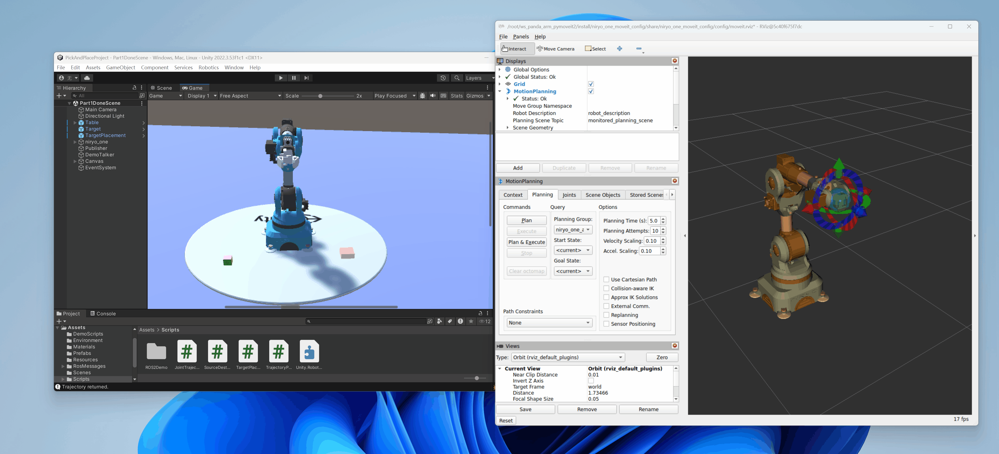

---

## 前言（Introduction）



**当机器人遇上游戏引擎：用Unity玩转机械臂仿真，妈妈再也不用担心我的Gazebo崩溃了！**

想用Gazebo给机器人搞个仿真？恭喜你，即将开启“从入门到放弃”的经典副本——环境配置复杂得像解一道高数题，而构建复杂场景时，Gazebo可能会用“卡顿”和“崩溃”来考验你的耐心。尤其对新手来说，光是搞明白为什么模型突然飞天遁地，就足以让人怀疑人生。

但别慌！这里有个更快乐（且不会让你头秃）的方案——**用Unity搭建仿真环境！** 没错，就是那个做《原神》和《王者荣耀》的Unity！它不仅能让你像搭积木一样轻松构建场景，还能搞定Gazebo挠破头都难实现的复杂环境（比如让机械臂在火星捡土豆，或者在水下拧瓶盖）。

今天，我们就来点好玩的：**用Unity仿真一个机械臂，再通过ROS2和RViz远程操控它！** 从此，你可以在Unity里造个虚拟实验室，而ROS2负责当“传话小哥”，让现实和仿真无缝对接。

**为什么选Unity？**

- **简单到流泪**：拖拖拽拽就能建场景，不用再和URDF文件“打架”。

- **画质狂魔**：想要光影效果？想要真实物理？Unity表示：“就这？”

- **ROS2的好基友**：通过ROS-TCP-Connector，Unity和ROS2秒变最佳拍档。

准备好让你的机械臂在Unity里跳个舞了吗？Let’s go！（Gazebo：明明是我先来的……）


**When Robots Meet Game Engines: Simulating Robotic Arms with Unity—Because Gazebo Crashes Are So Last Season!**

Trying to set up a robot simulation in Gazebo? Congratulations, you’re about to embark on the classic "From Beginner to Burnout" quest—where environment configuration feels like solving advanced calculus, and building complex scenes comes with Gazebo’s signature "lag-and-crash" combo. For beginners, just figuring out why your robot suddenly decided to phase through the floor or launch into orbit is enough to trigger an existential crisis.

But fear not! There’s a far more joyful (and less hair-pulling) alternative—**building your simulation in Unity!** Yep, the same Unity behind Genshin Impact and Honor of Kings. Not only does it let you assemble scenes like virtual LEGO, but it also handles complex environments that would make Gazebo sweat bullets (think robotic arms picking potatoes on Mars or unscrewing bottles underwater).

Today, we’re doing something fun: **simulating a robotic arm in Unity and controlling it remotely via ROS2 and RViz!** Now you can build a virtual lab in Unity while ROS2 acts as the middleman, seamlessly bridging simulation and reality.

**Why Unity?**

- **So easy it hurts**—Drag, drop, and build scenes without wrestling with URDF files.

- **Graphics wizardry**—Want realistic lighting and physics? Unity scoffs, "Is that all?"

- **ROS2’s best buddy**—With ROS-TCP-Connector, Unity and ROS2 become the ultimate dynamic duo.

Ready to make your robotic arm dance in Unity? Let’s go! (Gazebo: "But... I was here first...")

video：[ros2-rviz2控制unity仿真的6关节机械臂，探索从仿真到实际应用的过程](https://www.bilibili.com/video/BV1E9dkYAEkX/?vd_source=3bf4271e80f39cfee030114782480463)


> 参考：
> - [docker-ros2-unity-tcp-endpoint](https://github.com/frankjoshua/docker-ros2-unity-tcp-endpoint/tree/master)
> - [Robotics-Nav2-SLAM-Example](https://github.com/Unity-Technologies/Robotics-Nav2-SLAM-Example?tab=readme-ov-file)
> - [unity坐赛车游戏，简单三分钟了解一下](https://www.bilibili.com/video/BV1LU4y1o7re/?vd_source=3bf4271e80f39cfee030114782480463)
> - [How to Setup Unity and ROS2 in less than 5 minutes!](https://www.youtube.com/watch?v=1X6uzrvNwCk)
> - [ros2-for-unity](https://github.com/RobotecAI/ros2-for-unity)
> - [moveit2_yolobb_ws](https://github.com/laoxue888/moveit2_yolobb_ws)
> - [Unity-Robotics-Hub](https://github.com/Unity-Technologies/Unity-Robotics-Hub)


## 搭建开发环境（Setup Development Environment）

> - Unity:2022
> - Ubuntu:24.04
> - Ros2:jazzy

## 在window中安装Unity（Install Unity in window）

先安装Unityhuyb，然后再安装Unity

[https://unity.cn/releases](https://unity.cn/releases)

## 创建Docker容器，并安装相关软件（Create Docker containers and install related software）

❇️创建Docker容器

```shell
docker run -it -p 6080:80 -p 10000:10000 -v /tmp/.X11-unix:/tmp/.X11-unix -e DISPLAY=host.docker.internal:0.0 --gpus=all --name=Ros2UnityArm docker.1ms.run/ubuntu:24.04  /bin/bash
```

❇️安装相关软件

```shell
# 按照鱼香ros一键安装ros2
apt-get update
apt install wget -y
wget http://fishros.com/install -O fishros && bash fishros


# 安装远程显示服务程序
apt-get install x11-xserver-utils
apt install libxcb* -y
apt-get install x11-apps -y

# 安装moveit
apt install ros-${ROS_DISTRO}-moveit* -y

# 安装ros2的控制功能包
sudo apt install ros-${ROS_DISTRO}-controller-manager -y
sudo apt install ros-${ROS_DISTRO}-joint-trajectory-controller -y
sudo apt install ros-${ROS_DISTRO}-joint-state-broadcaster -y
sudo apt install ros-${ROS_DISTRO}-diff-drive-controller -y

# 安装其他功能包
# apt install ros-${ROS_DISTRO}-ros-gz -y
apt-get install ros-${ROS_DISTRO}-joint-state-publisher-gui -y
apt install ros-${ROS_DISTRO}-moveit-ros-planning-interface -y
# apt install ros-jazzy-gz-ros2-control 这个很重要 https://github.com/ros-controls/gz_ros2_control
apt install ros-${ROS_DISTRO}-gz-ros2-control -y

# 用于调试，可不安装
apt-get install gdb -y
```

## 运行测试（Run test）

```shell
source install/setup.bash
ros2 launch ros_tcp_endpoint endpoint.launch.py
```

```shell
source install/setup.bash
ros2 run unity_control_example follow_joint_trajectory_monitor
```

```shell
source install/setup.bash
ros2 launch niryo_one_moveit_config demo.launch.py
```
