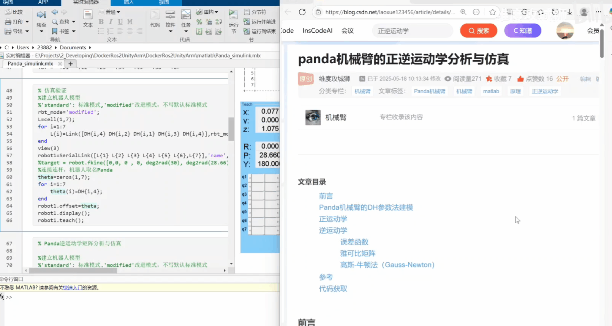
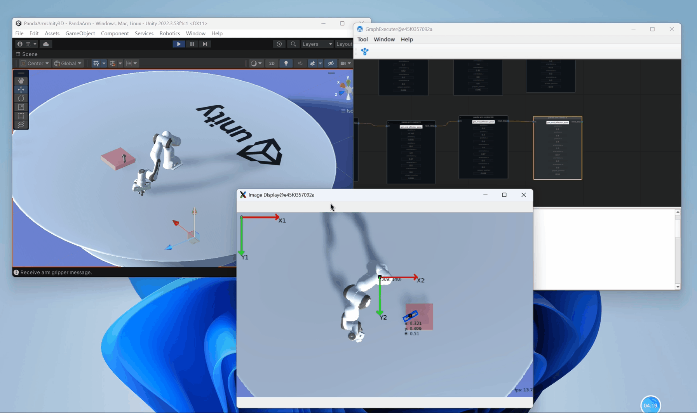
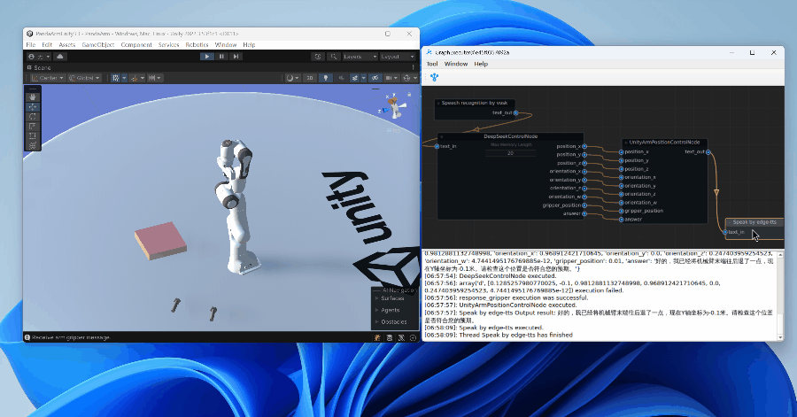
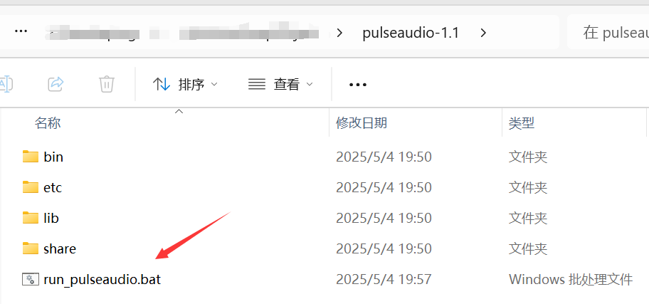

---

## 前言

本项目介绍通过Unity3D仿真Panda机械臂，为研究机械臂的控制算法、控制效果和构建复杂仿真环境提供虚拟化平台。


|||
|:---:|:---:|
|2025-5-18|2025-6-2|
|||
|2025-7-12||

要点：

- `PandaArmUnity3D`：`Unity3D`项目
- `ros2_docker_ws`：`ros2`项目
- `matlab`：包含了验证机械臂位置正逆运动学的算法分析
- `pulseaudio`：[window-docker的容器使用宿主机音频设备](https://zhuanlan.zhihu.com/p/1902399011333338104)


> **Update:**
> - [`2025-7-12`: DeepSeek控制Unity中的Panda仿真机械臂](https://blog.csdn.net/laoxue123456/article/details/149295283?spm=1011.2415.3001.5331)
> - `2025-6-15`: 增加了`docs\实测Ubuntu安装ros2的有效\实测Ubuntu安装ros2的有效.md`
> - [2025-6-2:YOLO机械臂丨使用unity搭建仿真环境，YOLO算法识别，Moveit2控制](https://www.bilibili.com/video/BV1657mzFEdd/?vd_source=3bf4271e80f39cfee030114782480463)
> - [2025-5-18: 机械臂位置正逆运动学原理与代码](https://www.bilibili.com/video/BV1ghJGzJEnp/?vd_source=3bf4271e80f39cfee030114782480463)
> - `2025-5-4`: 增加了`docs\window-docker的容器使用宿主机音频设备\window-docker的容器使用宿主机音频设备.md`
> - [2025-4-13: 【参考这个视频导入消息文件】ros2-rviz2控制unity仿真的6关节机械臂，探索从仿真到实际应用的过程](https://www.bilibili.com/video/BV1E9dkYAEkX/?vd_source=3bf4271e80f39cfee030114782480463)


## 克隆项目

```shell
git clone --recurse-submodules https://github.com/laoxue888/DockerRos2UnityArm.git
```

## 环境配置

[installation.md](docs/installation.md)


## 运行测试

❇️在windows上双击运行`PulseAudio`服务

> 该服务用于Docker调用宿主机音频设备。




❇️启动Unity

❇️编译项目

```shell    
colcon build
```

❇️启动tcp，用于ros2与unity连接
```shell
source install/setup.bash 
ros2 launch ros_tcp_endpoint endpoint.launch.py
```

❇️运行`moveitpy_controller`
```shell
# 打开新的终端
source install/setup.bash
ros2 launch control_server arm_control.launch.py
```

❇️运行`panda_moveit_config`的`demo.launch.py`
```shell
# 打开新的终端
source install/setup.bash
ros2 launch panda_moveit_config demo.launch.py
```

❇️运行`graph_executer`
```shell
# 打开新的终端
source install/setup.bash
cd src/GraphExecuter/graph_executer
python3 main.py
```

