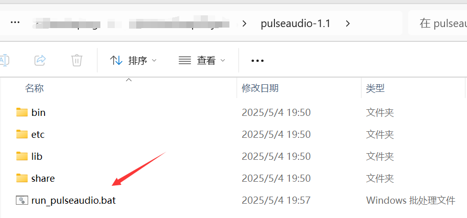

---

## 前言

本项目介绍通过Unity3D仿真Panda机械臂，为研究机械臂的控制算法、控制效果和构建复杂仿真环境提供虚拟化平台。


|||
|:---:|:---:|
|2025-5-18|2025-6-2|

要点：

- `PandaArmUnity3D`：`Unity3D`项目
- `ros2_docker_ws`：`ros2`项目
- `matlab`：包含了验证机械臂位置正逆运动学的算法分析
- `pulseaudio-1.1`：window-docker的容器使用宿主机音频设备


> **重要文件更新:**
> - `2025-6-15`: 增加了`ros2_docker_ws\src\_docs\normal_guide\ros2的安装.md`


> **video:**
> - [2025-6-2:YOLO机械臂丨使用unity搭建仿真环境，YOLO算法识别，Moveit2控制](https://www.bilibili.com/video/BV1657mzFEdd/?vd_source=3bf4271e80f39cfee030114782480463)
> - [2025-5-18: 机械臂位置正逆运动学原理与代码](https://www.bilibili.com/video/BV1ghJGzJEnp/?vd_source=3bf4271e80f39cfee030114782480463)
> - [2025-4-13: ros2-rviz2控制unity仿真的6关节机械臂，探索从仿真到实际应用的过程](https://www.bilibili.com/video/BV1E9dkYAEkX/?vd_source=3bf4271e80f39cfee030114782480463)


## 搭建开发环境

> - Unity:2022
> - Ubuntu:24.04
> - Ros2:jazzy

## 在window中安装Unity

先安装Unityhuyb，然后再安装Unity

[https://unity.cn/releases](https://unity.cn/releases)

## 创建Docker容器，并安装相关软件

❇️创建Docker容器

```shell
docker run -it -p 6080:80 -p 10000:10000 -v /tmp/.X11-unix:/tmp/.X11-unix -e DISPLAY=host.docker.internal:0.0 -e PULSE_SERVER=host.docker.internal --name=DockerUnityRos2Arm docker.1ms.run/ubuntu:24.04  /bin/bash
```

❇️安装相关软件

```shell
# 按照鱼香ros一键安装ros2
apt-get update
apt install wget -y
wget http://fishros.com/install -O fishros && bash fishros

# 安装远程显示服务程序
sudo apt-get install x11-xserver-utils
sudo apt install libxcb* -y
sudo apt-get install x11-apps -y

# 安装moveit
# 重新打开一个终端
sudo apt install ros-${ROS_DISTRO}-moveit* -y

# 安装ros2的控制功能包
sudo apt install ros-${ROS_DISTRO}-controller-manager -y
sudo apt install ros-${ROS_DISTRO}-joint-trajectory-controller -y
sudo apt install ros-${ROS_DISTRO}-joint-state-broadcaster -y
sudo apt install ros-${ROS_DISTRO}-diff-drive-controller -y

# 安装运行`graph_executer_controller`相关的Python包
sudo apt update
sudo apt install python3-pip -y
sudo apt-get install portaudio19-dev -y
sudo apt install espeak -y

# 安装音频
apt-get update && apt-get install -y alsa-utils pulseaudio
aplay -L  # 列出音频设备
# speaker-test -t wav  # 测试播放

# 使用清华源下载
cd src/graph_executer_controller/
pip install -r requirements.txt -i https://pypi.tuna.tsinghua.edu.cn/simple --break-system-packages
pip install pyqtgraph ultralytics --break-system-packages

# 调试工具
python3 -m pip install ipykernel -U --user --force-reinstall -i https://pypi.tuna.tsinghua.edu.cn/simple --break-system-packages

# 配置Ubuntu支持中文
sudo apt-get install language-pack-zh-hans -y
apt install vim -y

vim /etc/environment
# 添加内容
LANG="zh_CN.UTF-8"
LANGUAGE="zh_CN:zh:en_US:en"

vim /var/lib/locales/supported.d/local
# 添加内容
en_US.UTF-8 UTF-8
zh_CN.UTF-8 UTF-8
zh_CN.GBK GBK
zh_CN GB2312

sudo locale-gen

# 安装中文字体
sudo apt-get install fonts-droid-fallback ttf-wqy-zenhei ttf-wqy-microhei fonts-arphic-ukai fonts-arphic-uming -y

# 安装支持playsound的库
apt-get install libgstrtspserver-1.0-dev gstreamer1.0-rtsp -y
```

## 运行测试


❇️在windows上运行`PulseAudio`服务



❇️启动Unity

❇️编译项目

```shell    
colcon build
```

❇️启动tcp，用于ros2与unity连接
```shell
source install/setup.bash 
ros2 launch ros_tcp_endpoint endpoint.launch.py
```

❇️运行`moveitpy_controller`
```shell
# 打开新的终端
source install/setup.bash
ros2 launch control_server arm_control.launch.py
```

❇️运行`graph_executer_controller`
```shell
# 打开新的终端
source install/setup.bash
cd src/graph_executer_controller
python3 main.py
```

❇️运行`panda_moveit_config`的`demo.launch.py`
```shell
# 打开新的终端
source install/setup.bash
ros2 launch panda_moveit_config demo.launch.py
```
> 启动rviz2后，可以看到机械臂会有干涉，现手动调整到不干涉的位置，然后才使用moveitpy控制机械臂，否则无法控制机械臂。


# 改进

## 添加删除节点前的函数调用

问题描述：由于nodegraphqt没有删除节点的操作，这里为其添加。

在`/usr/local/lib/python3.12/dist-packages/NodeGraphQt/base/graph.py`的`NodeGraph`类的`delete_node(self, node, push_undo=True)`函数中添加以下内容：


```python
if hasattr(node, '_del_node'):
    node._del_node()
```

# 报错

##  ❌框选节点的时候报错

```shell
  File "/usr/local/lib/python3.12/dist-packages/NodeGraphQt/widgets/viewer.py", line 619, in mouseMoveEvent
    self.scene().setSelectionArea(
TypeError: 'PySide6.QtWidgets.QGraphicsScene.setSelectionArea' called with wrong argument types:
  PySide6.QtWidgets.QGraphicsScene.setSelectionArea(QPainterPath, ItemSelectionMode)
Supported signatures:
  PySide6.QtWidgets.QGraphicsScene.setSelectionArea(path: PySide6.QtGui.QPainterPath, /, selectionOperation: PySide6.QtCore.Qt.ItemSelectionOperation = Instance(Qt.ReplaceSelection), mode: PySide6.QtCore.Qt.ItemSelectionMode = Instance(Qt.IntersectsItemShape), deviceTransform: PySide6.QtGui.QTransform = Default(QTransform))
  PySide6.QtWidgets.QGraphicsScene.setSelectionArea(path: PySide6.QtGui.QPainterPath, deviceTransform: PySide6.QtGui.QTransform, /)
Error calling Python override of QGraphicsView::mouseMoveEvent(): Traceback (most recent call last):
  File "/usr/local/lib/python3.12/dist-packages/NodeGraphQt/widgets/viewer.py", line 619, in mouseMoveEvent
    self.scene().setSelectionArea(
TypeError: 'PySide6.QtWidgets.QGraphicsScene.setSelectionArea' called with wrong argument types:
  PySide6.QtWidgets.QGraphicsScene.setSelectionArea(QPainterPath, ItemSelectionMode)
Supported signatures:
  PySide6.QtWidgets.QGraphicsScene.setSelectionArea(path: PySide6.QtGui.QPainterPath, /, selectionOperation: PySide6.QtCore.Qt.ItemSelectionOperation = Instance(Qt.ReplaceSelection), mode: PySide6.QtCore.Qt.ItemSelectionMode = Instance(Qt.IntersectsItemShape), deviceTransform: PySide6.QtGui.QTransform = Default(QTransform))
  PySide6.QtWidgets.QGraphicsScene.setSelectionArea(path: PySide6.QtGui.QPainterPath, deviceTransform: PySide6.QtGui.QTransform, /)
```

✔️Pyside6和nodegraphqt版本不适配导致，更改`viewer.py`以下位置即可：

```shell
# "/usr/local/lib/python3.12/dist-packages/NodeGraphQt/widgets/viewer.py"

# self.scene().setSelectionArea(
#     path, QtCore.Qt.IntersectsItemShape
# )
self.scene().setSelectionArea(
    path,
    selectionOperation=QtCore.Qt.ItemSelectionOperation.ReplaceSelection,
    mode=QtCore.Qt.ItemSelectionMode.IntersectsItemShape
)
```


## ❌如果无法控制机械臂，查看rviz2的终端，应该会有

```shell
[move_group-3] [ERROR] [1748613208.480924749] [move_group.moveit.moveit.ros.check_start_state_bounds]: Joint 'panda_joint2' from the starting state is outside bounds by: [1.76294 ] should be in the range [-1.7628 ], [1.7628 ].
[move_group-3] [ERROR] [1748613208.480986559] [move_group]: PlanningRequestAdapter 'CheckStartStateBounds' failed, because 'Start state out of bounds.'. Aborting planning pipeline.
```

✔️:重新启动rviz2即可

## ❌规划路径超出范围

```shell
[ERROR] [1742603349.012384448] [moveit_3836862178.moveit.ros.check_start_state_bounds]: Joint 'panda_finger_joint1' from the starting state is outside bounds by: [-6.61565e-14 ] should be in the range [0 ], [0.04 ].
[ERROR] [1742603349.012503158] [moveit_py]: PlanningRequestAdapter 'CheckStartStateBounds' failed, because 'Start state out of bounds.'. Aborting planning pipeline.
[ERROR] [1742603349.013678982] [moveit_py.pose_goal]: Planning failed
```

✔️修改`joint_limits.yaml`，限制关节的最大最小位置


# 参考

> - [docker-ros2-unity-tcp-endpoint](https://github.com/frankjoshua/docker-ros2-unity-tcp-endpoint/tree/master)
> - [Robotics-Nav2-SLAM-Example](https://github.com/Unity-Technologies/Robotics-Nav2-SLAM-Example?tab=readme-ov-file)
> - [unity坐赛车游戏，简单三分钟了解一下](https://www.bilibili.com/video/BV1LU4y1o7re/?vd_source=3bf4271e80f39cfee030114782480463)
> - [How to Setup Unity and ROS2 in less than 5 minutes!](https://www.youtube.com/watch?v=1X6uzrvNwCk)
> - [ros2-for-unity](https://github.com/RobotecAI/ros2-for-unity)
> - [moveit2_yolobb_ws](https://github.com/laoxue888/moveit2_yolobb_ws)
> - [Unity-Robotics-Hub](https://github.com/Unity-Technologies/Unity-Robotics-Hub)
> - [JSON Output](https://api-docs.deepseek.com/zh-cn/guides/json_mode)
> - [DeepSeek提示库](https://api-docs.deepseek.com/zh-cn/prompt-library/)
> - [Binary Installation on Ubuntu](https://gazebosim.org/docs/harmonic/install_ubuntu/)
> - [Docs / Gazebo Harmonic](https://gazebosim.org/docs/harmonic/getstarted/)
> - [ros_gz branch jazzy](https://github.com/gazebosim/ros_gz/tree/jazzy)
