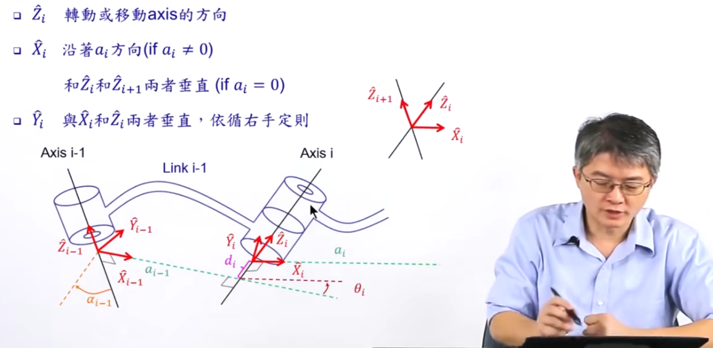
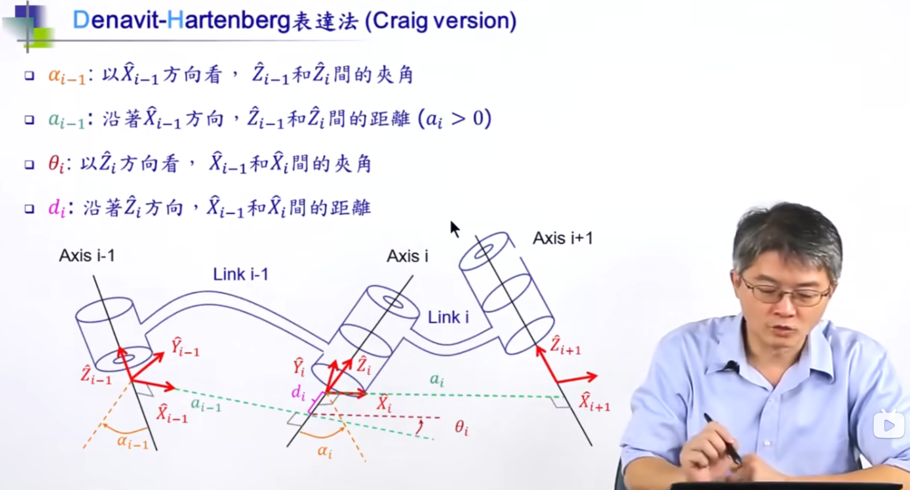
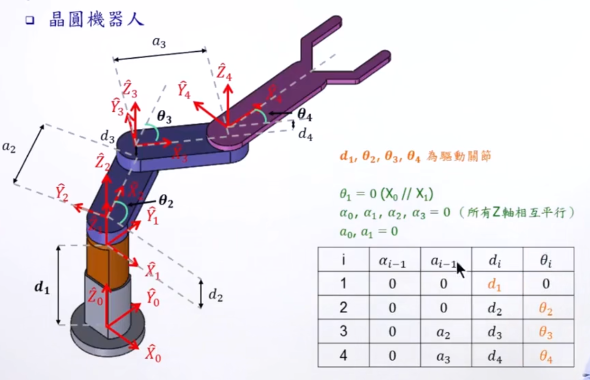
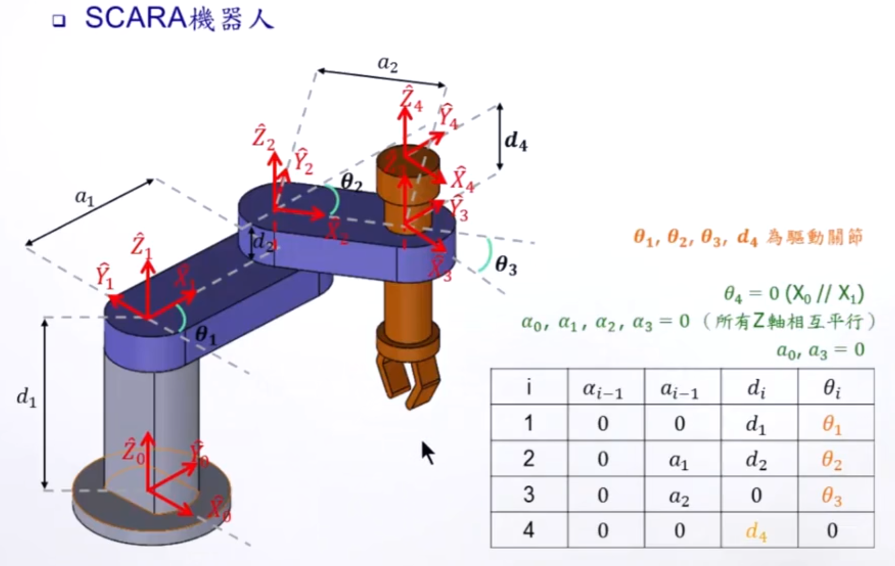
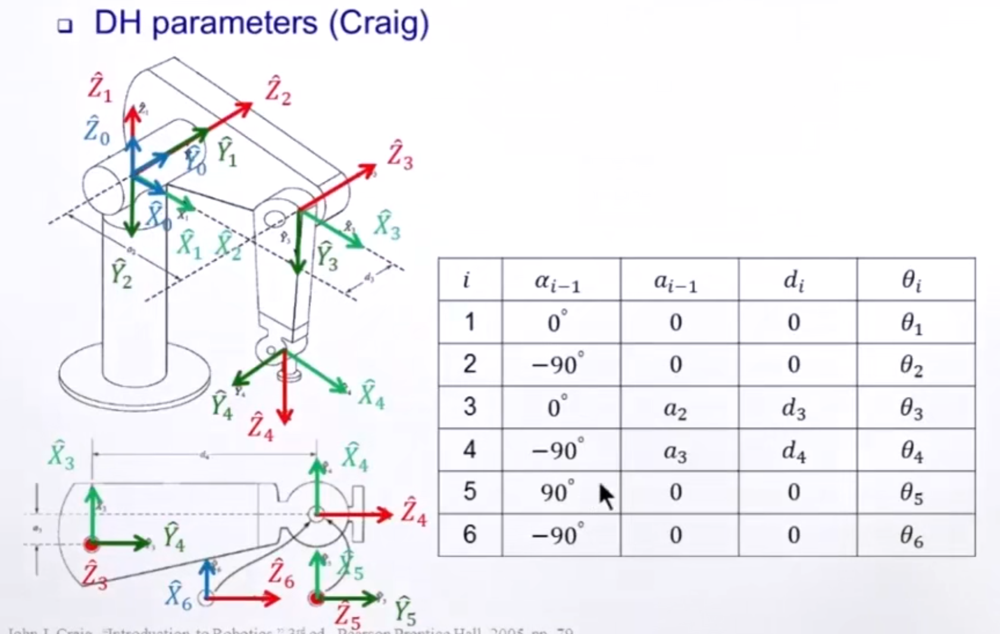
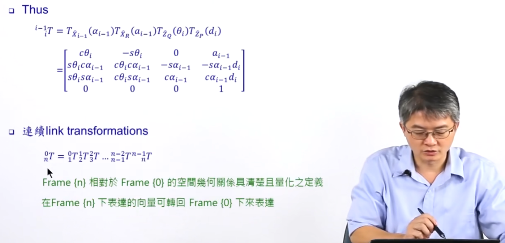
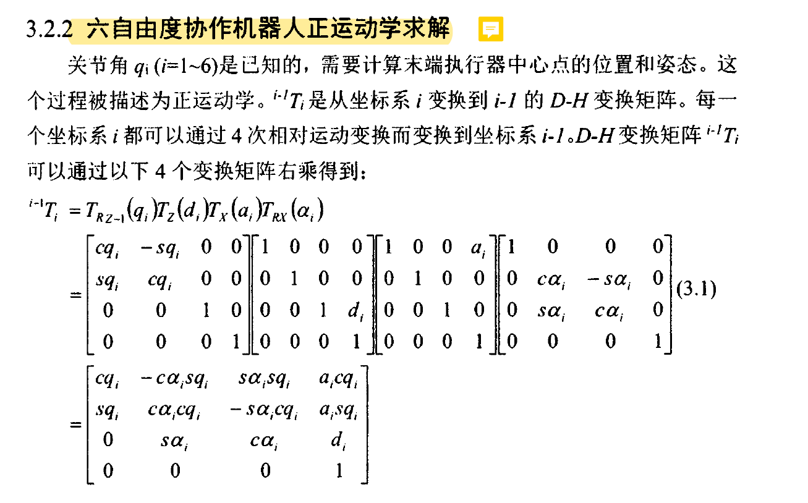

---

[TOC]

# 前言

逆运动学分析

> 参考：
> - [https://www.bilibili.com/video/BV1v4411H7ez?vd_source=3bf4271e80f39cfee030114782480463&p=19&spm_id_from=333.788.videopod.episodes](https://www.bilibili.com/video/BV1v4411H7ez?vd_source=3bf4271e80f39cfee030114782480463&p=19&spm_id_from=333.788.videopod.episodes)

# DH表确定

原理图

案例1

案例2

案例3

转换矩阵

这两个表达是一样的

