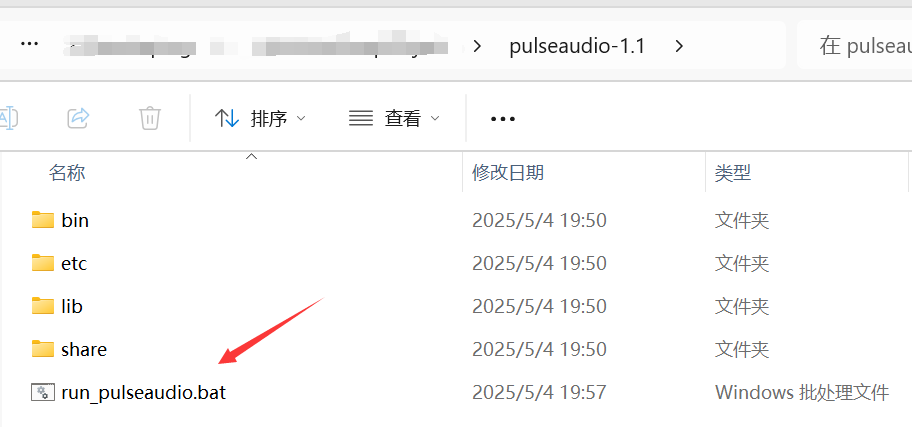
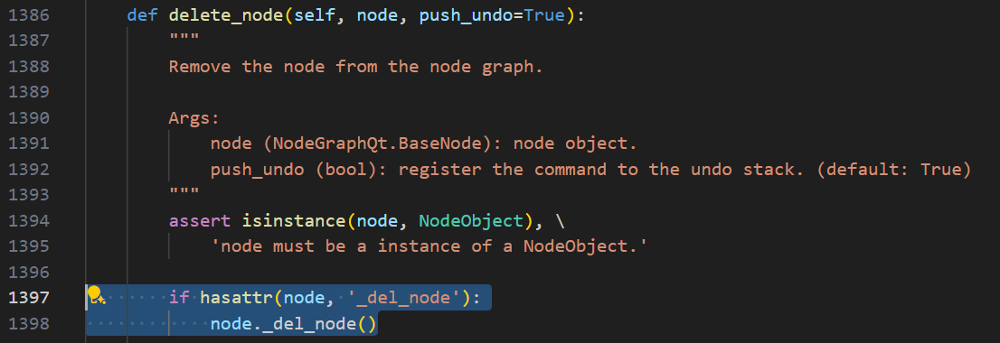

---

# 前言

实现yolo识别控制

> 参考：
> - [JSON Output](https://api-docs.deepseek.com/zh-cn/guides/json_mode)
> - [DeepSeek提示库](https://api-docs.deepseek.com/zh-cn/prompt-library/)
> - [Binary Installation on Ubuntu](https://gazebosim.org/docs/harmonic/install_ubuntu/)
> - [Docs / Gazebo Harmonic](https://gazebosim.org/docs/harmonic/getstarted/)
> - [ros_gz branch jazzy](https://github.com/gazebosim/ros_gz/tree/jazzy)

# 环境配置

- Unity: 2022
- Ubuntu:24.04
- Ros2:jazzy

❇️window配置pulseaudio服务

[window-docker的容器使用宿主机音频设备](https://blog.csdn.net/laoxue123456/article/details/147700691?spm=1011.2415.3001.5331)


❇️创建Docker容器

```shell
docker run -it -p 6080:80 -p 10000:10000 -v /tmp/.X11-unix:/tmp/.X11-unix -e DISPLAY=host.docker.internal:0.0 -e PULSE_SERVER=host.docker.internal --name=DockerUnityRos2LLM docker.1ms.run/ubuntu:24.04  /bin/bash
```

❇️配置开发环境

```shell
# 按照鱼香ros一键安装ros2
apt-get update
apt install wget -y
wget http://fishros.com/install -O fishros && bash fishros

# 安装远程显示服务程序
sudo apt-get install x11-xserver-utils
sudo apt install libxcb* -y
sudo apt-get install x11-apps -y

# 安装moveit
# 重新打开一个终端
sudo apt install ros-${ROS_DISTRO}-moveit* -y

# 安装ros2的控制功能包
sudo apt install ros-${ROS_DISTRO}-controller-manager -y
sudo apt install ros-${ROS_DISTRO}-joint-trajectory-controller -y
sudo apt install ros-${ROS_DISTRO}-joint-state-broadcaster -y
sudo apt install ros-${ROS_DISTRO}-diff-drive-controller -y

# 安装运行`graph_executer_controller`相关的Python包
sudo apt update
sudo apt install python3-pip -y
sudo apt-get install portaudio19-dev -y
sudo apt install espeak -y

# 安装音频
apt-get update && apt-get install -y alsa-utils pulseaudio
aplay -L  # 列出音频设备
# speaker-test -t wav  # 测试播放

# 使用清华源下载
cd src/graph_executer_controller/
pip install -r requirements.txt -i https://pypi.tuna.tsinghua.edu.cn/simple --break-system-packages
pip install pyqtgraph ultralytics --break-system-packages


# 调试工具
python3 -m pip install ipykernel -U --user --force-reinstall -i https://pypi.tuna.tsinghua.edu.cn/simple --break-system-packages


# 配置Ubuntu支持中文
sudo apt-get install language-pack-zh-hans -y
apt install vim -y

vim /etc/environment
# 添加内容
LANG="zh_CN.UTF-8"
LANGUAGE="zh_CN:zh:en_US:en"

vim /var/lib/locales/supported.d/local
# 添加内容
en_US.UTF-8 UTF-8
zh_CN.UTF-8 UTF-8
zh_CN.GBK GBK
zh_CN GB2312

sudo locale-gen

# 安装中文字体
sudo apt-get install fonts-droid-fallback ttf-wqy-zenhei ttf-wqy-microhei fonts-arphic-ukai fonts-arphic-uming -y

# 安装支持playsound的库
apt-get install libgstrtspserver-1.0-dev gstreamer1.0-rtsp -y

# 安装mujoco
mkdir /opt/mujoco_softwares
cd /opt/mujoco_softwares/
wget https://github.com/google-deepmind/mujoco/releases/download/3.3.2/mujoco-3.3.2-linux-x86_64.tar.gz
tar xvzf mujoco-3.3.2-linux-x86_64.tar.gz 
echo "export PATH=$PATH:/opt/mujoco_softwares/mujoco-3.3.2/bin" >> ~/.bashrc
source ~/.bashrc
# 测试
#simulate /opt/mujoco_softwares/mujoco-3.3.2/model/humanoid/humanoid.xml
pip install mujoco -i https://pypi.tuna.tsinghua.edu.cn/simple --break-system-packages

# 安装gz
sudo apt-get update
sudo apt-get install curl lsb-release gnupg

sudo curl https://packages.osrfoundation.org/gazebo.gpg --output /usr/share/keyrings/pkgs-osrf-archive-keyring.gpg
echo "deb [arch=$(dpkg --print-architecture) signed-by=/usr/share/keyrings/pkgs-osrf-archive-keyring.gpg] http://packages.osrfoundation.org/gazebo/ubuntu-stable $(lsb_release -cs) main" | sudo tee /etc/apt/sources.list.d/gazebo-stable.list > /dev/null
sudo apt-get update
sudo apt-get install gz-harmonic

sudo sh -c 'echo "deb [arch=$(dpkg --print-architecture)] http://packages.ros.org/ros2/ubuntu $(lsb_release -cs) main" > /etc/apt/sources.list.d/ros2-latest.list'
curl -s https://raw.githubusercontent.com/ros/rosdistro/master/ros.asc | sudo apt-key add -
sudo apt-get update
sudo apt install ros-jazzy-ros-gz -y

apt install ros-${ROS_DISTRO}-gz-ros2-control -y
```

# 运行测试

❇️在windows上运行`PulseAudio`服务



❇️编译项目

```shell    
colcon build
```

❇️启动tcp，用于ros2与unity连接
```shell
source install/setup.bash 
ros2 launch ros_tcp_endpoint endpoint.launch.py
```

❇️运行`moveitpy_controller`
```shell
# 打开新的终端
source install/setup.bash
ros2 launch control_server arm_control.launch.py
```

❇️运行`graph_executer_controller`
```shell
# 打开新的终端
source install/setup.bash
cd src/graph_executer_controller
python3 main.py
```

❇️运行`panda_moveit_config`的`demo.launch.py`
```shell
# 打开新的终端
source install/setup.bash
ros2 launch panda_moveit_config demo.launch.py
```
> 启动rviz2后，可以看到机械臂会有干涉，现手动调整到不干涉的位置，然后才使用moveitpy控制机械臂，否则无法控制机械臂。

# 改进

##  ❌框选节点的时候报错

```shell
  File "/usr/local/lib/python3.12/dist-packages/NodeGraphQt/widgets/viewer.py", line 619, in mouseMoveEvent
    self.scene().setSelectionArea(
TypeError: 'PySide6.QtWidgets.QGraphicsScene.setSelectionArea' called with wrong argument types:
  PySide6.QtWidgets.QGraphicsScene.setSelectionArea(QPainterPath, ItemSelectionMode)
Supported signatures:
  PySide6.QtWidgets.QGraphicsScene.setSelectionArea(path: PySide6.QtGui.QPainterPath, /, selectionOperation: PySide6.QtCore.Qt.ItemSelectionOperation = Instance(Qt.ReplaceSelection), mode: PySide6.QtCore.Qt.ItemSelectionMode = Instance(Qt.IntersectsItemShape), deviceTransform: PySide6.QtGui.QTransform = Default(QTransform))
  PySide6.QtWidgets.QGraphicsScene.setSelectionArea(path: PySide6.QtGui.QPainterPath, deviceTransform: PySide6.QtGui.QTransform, /)
Error calling Python override of QGraphicsView::mouseMoveEvent(): Traceback (most recent call last):
  File "/usr/local/lib/python3.12/dist-packages/NodeGraphQt/widgets/viewer.py", line 619, in mouseMoveEvent
    self.scene().setSelectionArea(
TypeError: 'PySide6.QtWidgets.QGraphicsScene.setSelectionArea' called with wrong argument types:
  PySide6.QtWidgets.QGraphicsScene.setSelectionArea(QPainterPath, ItemSelectionMode)
Supported signatures:
  PySide6.QtWidgets.QGraphicsScene.setSelectionArea(path: PySide6.QtGui.QPainterPath, /, selectionOperation: PySide6.QtCore.Qt.ItemSelectionOperation = Instance(Qt.ReplaceSelection), mode: PySide6.QtCore.Qt.ItemSelectionMode = Instance(Qt.IntersectsItemShape), deviceTransform: PySide6.QtGui.QTransform = Default(QTransform))
  PySide6.QtWidgets.QGraphicsScene.setSelectionArea(path: PySide6.QtGui.QPainterPath, deviceTransform: PySide6.QtGui.QTransform, /)
```

✔️Pyside6和nodegraphqt版本不适配导致，更改`viewer.py`以下位置即可：

```shell
# "/usr/local/lib/python3.12/dist-packages/NodeGraphQt/widgets/viewer.py"

# self.scene().setSelectionArea(
#     path, QtCore.Qt.IntersectsItemShape
# )
self.scene().setSelectionArea(
    path,
    selectionOperation=QtCore.Qt.ItemSelectionOperation.ReplaceSelection,
    mode=QtCore.Qt.ItemSelectionMode.IntersectsItemShape
)
```

## 添加删除节点前的函数调用

问题描述：由于nodegraphqt没有删除节点的操作，这里为其添加。

在`/usr/local/lib/python3.12/dist-packages/NodeGraphQt/base/graph.py`的`NodeGraph`类的`delete_node(self, node, push_undo=True)`函数中添加以下内容：



```python
if hasattr(node, '_del_node'):
    node._del_node()
```